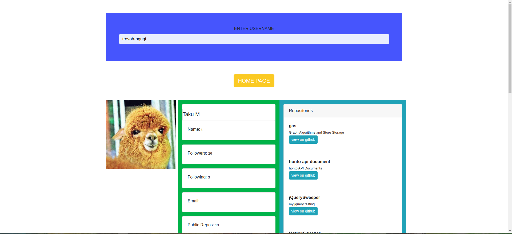

# Gitsearch
## project Author
> **NAME :** Kenneth Ochieng Joseph
This project was generated with [Angular CLI](https://github.com/angular/angular-cli) version 8.3.19.

## Development server

>Run `ng serve` for a dev server. Navigate to `http://localhost:4200/`. The app will automatically reload if you change any of the source files.

## Code scaffolding

>Run `ng generate component component-name` to generate a new component. You can also use `ng generate directive|pipe|service|class|guard|interface|enum|module`.

## Build

>Run `ng build` to build the project. The build artifacts will be stored in the `dist/` directory. Use the `--prod` flag for a production build.

## Running unit tests

>Run `ng test` to execute the unit tests via [Karma](https://karma-runner.github.io).

## Running end-to-end tests

>Run `ng e2e` to execute the end-to-end tests via [Protractor](http://www.protractortest.org/).

## Further help

>To get more help on the Angular CLI use `ng help` or go check out the [Angular CLI README](https://github.com/angular/angular-cli/blob/master/README.md).

## Screenshots
> **Visual Presentation of My Work**
 >>##### shows the main page

 >>##### shows the search page

## Description
>A platform where one can easily search his or her github accunt and access it easily and more effeciently following how great the site is designed to make the users experience much more easier and faster

## Who it serves
> This project serves any user, who has a github account or whom is willing to gain an easier access to an account and would love to make it faster.

